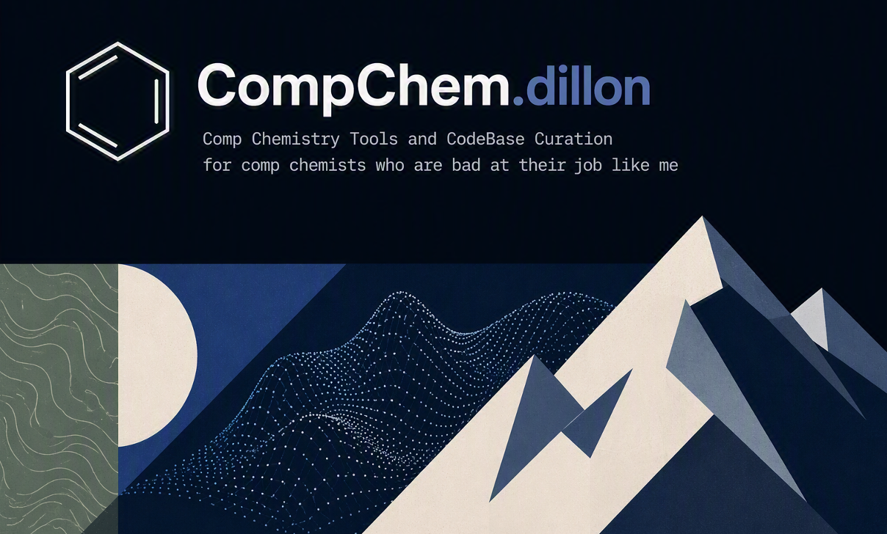

### Hello!
I'm a computational chemist. Most of what I do lives at the intersection of molecular modeling, scientific computing, and optimizing my setup for the 5th time the same day. I love tools and the cutting edge, and am always looking for new opportunities to try new things. 

This account is where I keep tools, helpers, and half-organized code for making comp chem workflows a little less miserable. Nothing here is fancy — it's the stuff I wish someone had handed me on day one.

### What I'm usually up to:

- *Simulation, modeling, and data analysis*
- *Automation and workflow development on HPC clusters (Slurm, Torque, AWS)*
- *Python + bash scripting, git, reproducible-ish workflows*
- *Writing docs so that i can keep myself organized (kinda)*
- *Hobbies: Anthing in the mountains, or just hanging out at home.*

*Building tools for comp chemists who are bad at their job like me.*

### My Current Projects

- *Small Molecule Drug Discovery*
- *BRO5 Drug Discovery (especially nucleic acids)*
- *Scientific image generation and consulting for 3D models (i.e. prot/lig binding, complex workflows...)*

### Planned Projects
- Test1 <dt>Test</dt> Test2

#### See my website here (under construction).

<!--
**dillonrmccarthy/dillonrmccarthy** is a ✨ _special_ ✨ repository because its `README.md` (this file) appears on your GitHub profile.

Here are some ideas to get you started:

- 🔭 I’m currently working on ...
- 🌱 I’m currently learning ...
- 👯 I’m looking to collaborate on ...
- 🤔 I’m looking for help with ...
- 💬 Ask me about ...
- 📫 How to reach me: ...
- 😄 Pronouns: ...
- ⚡ Fun fact: ...
-->
